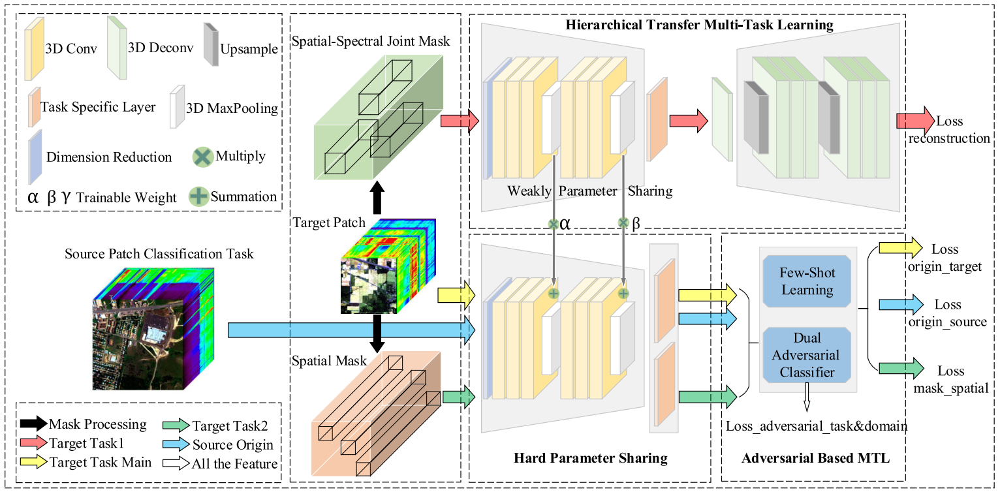

## A Hybrid Multitask Learning Network for Hyperspectral Image Classification
This is a code demo for the paper "A Hybrid Multitask Learning Network for Hyperspectral Image Classification"

URL to the paper: 
https://ieeexplore.ieee.org/document/10409251

Some of our code references the project:
[Deep Cross-domain Few-shot Learning for Hyperspectral Image Classification](https://github.com/Li-ZK/DCFSL-2021)
## Brief Introduction

Recently, the field of hyperspectral image (HSI) classification has witnessed advancements with the emergence of deep learning models. Promising approaches, such as self-supervised strategies and domain adaptation, have effectively tackled the overfitting challenges posed by limited labeled samples in HSI classification. To extract comprehensive semantic information from different types of auxiliary tasks, which view the problem from multiple perspectives, and efficiently integrate multiple tasks into a single network, this article proposes a hybrid multitask learning (MTL) framework (HyMuT) by sharing representations across multiple tasks. Based on the similarity between the data and the target classification task, we construct three auxiliary tasks that are similar, related, and weakly correlated to the target task, while three corresponding MTL methods are integrated. The framework establishes a backbone network with a hard parameter sharing mechanism, which handles the main task and a similar spatial mask classification task. Subsequently, a hierarchical transfer MTL approach is introduced to transfer the knowledge of a spatial-spectral joint mask reconstruction task from the autoencoder to the backbone network. Furthermore, a new source domain HSI dataset is introduced as an auxiliary task weakly correlated. To solve the source domain classification task and assist the hard parameter sharing mechanism, a dual adversarial classifier based on adversarial learning is employed. This classifier effectively extracts domain and task invariance. Extensive experiments are conducted on four benchmark HSI datasets to evaluate the performance. The results demonstrate that HyMuT outperforms state-of-the-art methods.

## Requirements
CUDA = 10.0

Python = 3.7 

Pytorch = 1.5 

sklearn = 0.23.2

numpy = 1.19.2

## Dataset
1. target domain data set:

You can download the hyperspectral datasets at: http://www.ehu.eus/ccwintco/index.php/Hyperspectral_Remote_Sensing_Scenes, and https://hyperspectral.ee.uh.edu/?page_id=459. Please move the files to `./datasets` folder.

2. source domain data set:

The source domain  hyperspectral datasets (Chikusei) in mat format is available in:http://park.itc.utokyo.ac.jp/sal/hyperdata.

## Usage:
1. Download the required data set and move to folder`./datasets`.
2. If you down the source domain data set (Chikusei) in mat format,you need to run the script `Chikusei_imdb_128.py` to generate preprocessed source domain data. 
3. Run the file corresponding to the dataset name